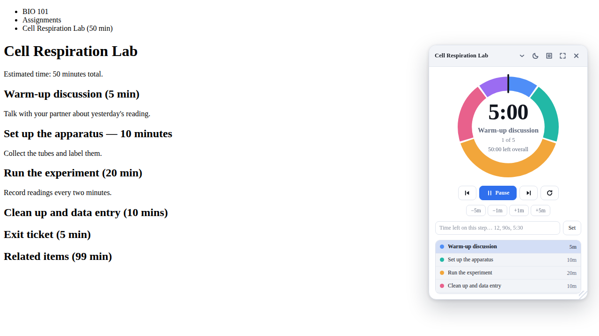

# Canvas Activity Timer

A Chrome extension that reads a Canvas activity page, pulls out the activity
name and its timed subsections, and runs them as a floating countdown whose
dial is split into one wedge per subsection.



## Installing it

The extension is unpacked — there is no build step.

1. Open `chrome://extensions`.
2. Turn on **Developer mode** (top right).
3. Click **Load unpacked** and pick this folder.

It activates on `*.instructure.com`, `*.instructure.com.au` and `*.canvas.net`.
If your school self-hosts Canvas on its own domain, open the popup on one of
its pages and click **Enable on this site** — that asks for permission for
that one host and registers the content script for it.

## Using it

Open a Canvas assignment, page, discussion or quiz and click the toolbar icon.

**Before the run.** The popup shows the activity name and every subsection it
found, with its length. Everything is editable: rename a subsection, change a
time, remove one, or add your own. Durations accept plain minutes (`12`),
`mm:ss` (`5:30`), or words (`90s`, `1h 15m`). The running total is shown above
**Start timer**. Your edits are kept per page, so closing the popup does not
lose them; **Rescan page** throws them away and reads the page again.

**During the run.** A panel appears on the page:

| | |
|---|---|
| **Move it** | Drag the header. It stays where you put it, on every Canvas page. |
| **Resize it** | Drag the bottom-right corner, or click the size button to cycle small / medium / large. |
| **Full screen** | The expand button, or press `F`. `Escape` leaves. |
| **Light / dark** | The moon button cycles system, light, dark. |
| **±time** | `−5m` `−1m` `+1m` `+5m` change the subsection you are in, and the total with it. |
| **Custom time** | Type into the field to set exactly how long is left on this step. |
| **Jump** | Click a wedge of the dial, or a row in the list, to go to that subsection. |
| **Flashing** | The panel flashes when a subsection is nearly over, and flashes twice as fast for the last ten seconds. |

The big number is the time left in the current subsection; click it to swap it
with the total. The dial drains clockwise — the bright arc is what is left, the
faint arc behind it is what the plan allowed, and finished wedges dim out.

The toolbar badge shows the time left even when you are on another tab, and a
notification fires when the last subsection runs out.

## What it reads off the page

Canvas has no field for "this step takes ten minutes", so the times are read out
of the page text. Four strategies run and whichever finds the most subsections
wins:

| Layout | Example |
|---|---|
| Headings | `<h2>Warm-up discussion (5 min)</h2>` |
| List items | `<li>Station 1: Sketching — 12 minutes</li>` |
| Table rows | `Opening question` \| `5 min` (two columns) |
| Paragraphs | `<p>Draft your opening claim (15 min)</p>` |

Recognised forms include `10 min`, `1 hr 30`, `5-10 minutes` (the upper bound is
used), `1/4 hour`, `half an hour`, `(1:30)` and `[1:02:30]`. A bare clock time
such as "Due Friday 3:30" is deliberately **not** read as a duration unless it
is bracketed or introduced by a time word, and a single subsection over eight
hours is rejected as a misparse.

Nothing found? The popup falls back to any stated "estimated time: 45 minutes",
and failing that you can build the plan by hand.

## How it fits together

```
manifest.json              MV3, Canvas hosts, optional opt-in for self-hosted ones
src/common/
  constants.js             defaults, message names, palette
  duration.js              text -> seconds, and seconds -> text
  session.js               the timer model and all of its arithmetic
src/content/
  scanner.js               reads a Canvas page into {activity, segments}
  dial.js                  the segmented ring
  overlay.js               the floating panel
  overlay.css              its styles (loaded into a shadow root)
  content.js               mirrors stored state onto the panel
src/background/
  service-worker.js        the only writer of timer state; badge, alarms, notification
src/popup/                 the planning UI
tools/make-icons.cjs       regenerates the PNG icons
test/                      five suites, run with `npm test`
```

Two decisions are worth knowing about:

**Elapsed time comes from a wall clock, not a tick count.** The session stores
when it was last started and how much had been used before that; every readout
derives the rest from `Date.now()`. A throttled background tab, a slow frame or
a sleeping laptop cannot make the countdown drift.

**The service worker is the only writer.** Each surface sends a command; the
worker mutates the session, writes it to `chrome.storage.local`, and the storage
change event fans out. That is why the popup, the panel and a second Canvas tab
can never disagree about what the clock says.

## Development

```bash
npm install     # playwright, for the browser suites
npm test        # all five suites
npm run icons   # regenerate icons/*.png
```

`npm test` loads the unpacked extension into Chromium and drives it: it scans
fixture pages shaped like real Canvas assignments, starts a timer, drags and
resizes the panel, toggles full screen, and checks the badge, the alarms and the
notification at zero. Screenshots land in `$CAT_SHOTS` if you set it.

The browser suites need Chromium's new headless mode, which Playwright selects
via `channel: 'chromium'`; unpacked extensions do not load under old headless.
